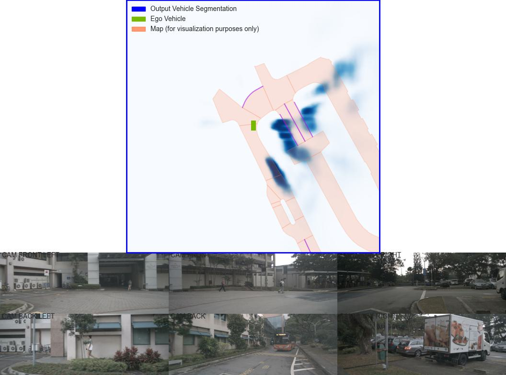

# Lift, Splat, Shoot:LSS --> with more detail

PyTorch code for Lift-Splat-Shoot (ECCV 2020).

**Lift, Splat, Shoot: Encoding Images From Arbitrary Camera Rigs by Implicitly Unprojecting to 3D**  
Jonah Philion, [Sanja Fidler](http://www.cs.toronto.edu/~fidler/)\
ECCV, 2020 (Poster)\
**[[Paper](https://arxiv.org/abs/2008.05711)] [[Project Page](https://nv-tlabs.github.io/lift-splat-shoot/)] [[10-min video](https://youtu.be/oL5ISk6BnDE)] [[1-min video](https://youtu.be/ypQQUG4nFJY)]**

### Citation
If you found this codebase useful in your research, please consider citing
```
@inproceedings{philion2020lift,
    title={Lift, Splat, Shoot: Encoding Images From Arbitrary Camera Rigs by Implicitly Unprojecting to 3D},
    author={Jonah Philion and Sanja Fidler},
    booktitle={Proceedings of the European Conference on Computer Vision},
    year={2020},
}
```

### Preparation
Download nuscenes data from [https://www.nuscenes.org/](https://www.nuscenes.org/). Install dependencies.
And then install the dataset according to the directory, may be you need to change the code where using the dataset name


### Pre-trained Model
Download a pre-trained BEV vehicle segmentation model from here: [https://drive.google.com/file/d/1bsUYveW_eOqa4lglryyGQNeC4fyQWvQQ/view?usp=sharing](https://drive.google.com/file/d/1bsUYveW_eOqa4lglryyGQNeC4fyQWvQQ/view?usp=sharing)

| Vehicle IOU (reported in paper)        | Vehicle IOU (this repository)         |
|:-------------:|:-------------:| 
| 32.07      | 33.03 |


### Visualize Predictions
Visualize the BEV segmentation output by a model:

```
python visualization_tym.py
```


### visualization_tym.py is written by author yueming! Hope this can help you!
